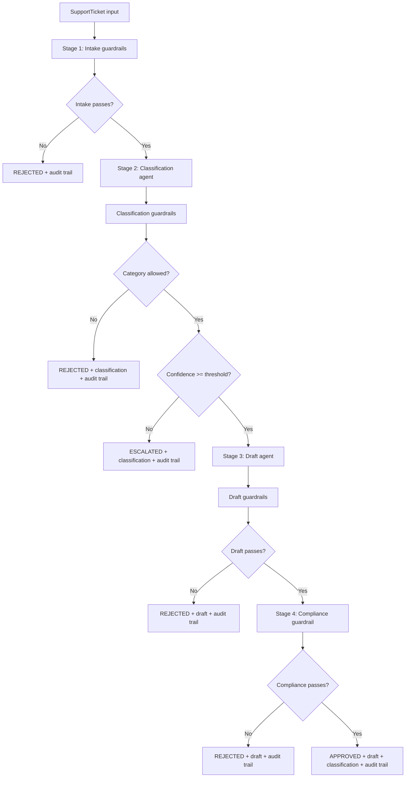

# uoe-agents

A tutorial repository for building a minimal agent + MCP server setup with Pydantic AI and Ollama.

## Overview

This project contains:
- An MCP server exposing one tool (`add`) over `streamable-http` transport.
- An MCP client/agent that connects to that server and uses an Ollama model.

## Prerequisites

- macOS, Linux, or Windows
- Python 3.14+
- [uv](https://docs.astral.sh/uv/) (recommended) or `pip`
- [Ollama](https://ollama.com/)

## 1) Install Ollama

Choose the install path for your OS:

### macOS

Option A (official app):
1. Download and install from https://ollama.com/download
2. Launch Ollama once so the local server starts.

Option B (Homebrew):
```bash
brew install ollama
```

### Linux

Install using the official script:
```bash
curl -fsSL https://ollama.com/install.sh | sh
```

Then start Ollama (if not started automatically):
```bash
ollama serve
```

### Windows

1. Download and install from https://ollama.com/download
2. Start the Ollama application.

### Verify Ollama is running

In a terminal:
```bash
ollama --version
```

## 2) Pull the model used by this repo

This repository uses `qwen3.5:2b` by default in the client code.

```bash
ollama pull qwen3.5:2b
```

You can test it quickly:
```bash
ollama run qwen3.5:2b "Say hello in one sentence"
```

## 3) Clone and install this repository

```bash
git clone <your-repo-url>
cd uoe-agents
```

### Install dependencies with uv (recommended)

```bash
uv sync
```

### Alternative install with pip

```bash
python -m venv .venv
source .venv/bin/activate  # On Windows: .venv\Scripts\activate
pip install -U pip
pip install -e .
```

## 4) Run the MCP server

Start the server in one terminal:

```bash
uv run python mcp_server.py
```

By default, this serves MCP over HTTP on `http://localhost:8000/mcp`.

## 5) Run the MCP client/agent

In another terminal:

```bash
uv run python mcp_client.py
```

The client will:
1. Connect to the MCP server at `http://localhost:8000/mcp`
2. Use the local Ollama API at `http://localhost:11434/v1`
3. Run a sample prompt that should invoke the `add` tool

## Troubleshooting

- `Connection refused` to `localhost:8000`: start `mcp_server.py` first.
- `Connection refused` to `localhost:11434`: ensure Ollama app/service is running.
- Model not found: run `ollama pull qwen3.5:2b`.
- Python version error: use Python 3.14+ to satisfy `pyproject.toml`.

## File-by-file documentation

- `README.md`
	- Project documentation, setup instructions, usage, and troubleshooting.

- `pyproject.toml`
	- Python project metadata and dependency definitions.
	- Declares package name/version and runtime requirement (`>=3.14`).
	- Pins the main dependency: `pydantic-ai-slim[mcp,openai]`.

- `mcp_server.py`
	- Defines and runs a FastMCP server.
	- Registers one tool, `add(a: int, b: int) -> int`.
	- Exposes the MCP endpoint over `streamable-http` transport.

- `mcp_client.py`
	- Configures a Pydantic AI `Agent`.
	- Connects to the local MCP server toolset.
	- Connects to Ollama through OpenAI-compatible API.
	- Sends a sample prompt and prints the model output.

- `prompt_chaining.py`
	- Demonstrates the prompt chaining pattern.
	- Uses three sequential agents: research -> draft -> polish.
	- Shows structured handoff with typed intermediate outputs.

- `parallelisation.py`
	- Demonstrates the parallelisation pattern.
	- Runs three specialist agents concurrently, then synthesises their reports.
	- Useful for reducing latency while broadening analysis coverage.

- `guardrailed_pipeline.py`
	- Demonstrates a combined pipeline + guardrail pattern.
	- Processes support tickets through staged validation, classification, drafting, and compliance checks.
	- Produces a final decision (`approved`, `escalated`, or `rejected`) with a full guardrail audit trail.

- `LICENSE`
	- Repository license terms.

## Guardrailed Pipeline Flow



Legend:
- `REJECTED`: hard guardrail failure; do not send auto-response.
- `ESCALATED`: uncertain classification; route to human support queue.
- `APPROVED`: all stage guardrails passed; response is safe to send.
